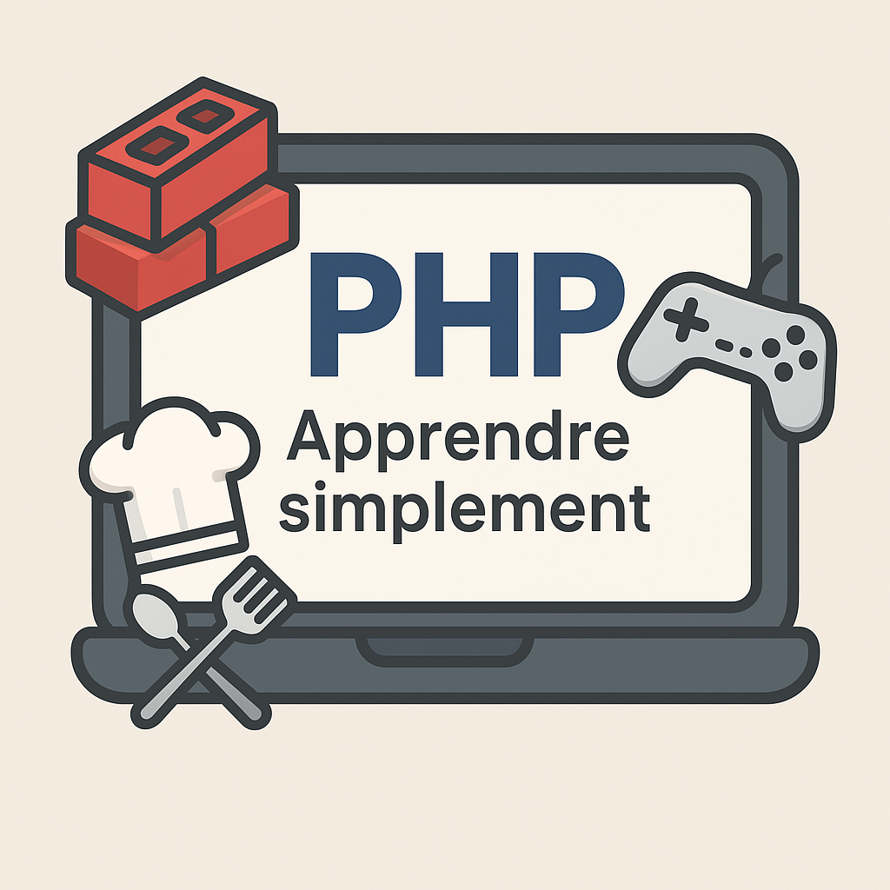

# 🚀 Cours PHP Débutant — Le Chantier du Code 👷‍♂️💻  

---

## 👋 Bienvenue sur le chantier du code !

Salut à toi, futur **maître du clavier** 🧙‍♂️💻 !  
Ici, on va apprendre à coder en **PHP**, mais pas de manière ennuyeuse...  
Non non 😎  
Ici, **chaque ligne de code a une histoire**.

Tu vas découvrir **trois univers incroyables** pour apprendre le même langage :

| Thème | Style | Exemple |
|:--|:--|:--|
| 👷‍♂️ **Maçon** | Tu construis ton code comme un mur solide 🧱 | `if` c’est ton niveau à bulle, `while` c’est ton rythme de travail |
| 👨‍🍳 **Cuisinier** | Tu prépares tes variables comme des ingrédients 🍳 | Une fonction, c’est ta recette secrète |
| 🎮 **Gamer** | Tu gères ton inventaire comme un RPG ⚔️ | Les tableaux, ce sont tes armes et potions magiques |

Peu importe ton univers préféré…  
👉 Tu apprendras **les mêmes bases** du langage PHP de manière ludique et concrète !

---

## 🧱 Pourquoi apprendre PHP ?

Parce que **PHP, c’est la base du web dynamique**.  
C’est ce qui fait tourner **des millions de sites dans le monde** (WordPress, Wikipédia, etc.).  

Et surtout, **c’est le langage parfait pour débuter** :
- Il est **facile à comprendre** 🧠  
- Il s’exécute **directement dans ton navigateur** 🌐  
- Et tu peux **voir le résultat immédiatement** ⚡  

💬 Bref : c’est comme apprendre à poser des briques…  
sauf qu’ici, tu construis des **sites web**.

---

## 📚 Le parcours à suivre

Ton apprentissage suit **le plan d’un chantier** — étape par étape, sans rien oublier 🧰  

| Étape | Fichier | Ce que tu apprends | Thème possible |
|:--|:--|:--|:--|
| 🪣 01 | `apprendre_php_debutant_01_variables.md` | Les variables | 👷 Le maçon qui range ses outils |
| 🌦️ 02 | `apprendre_php_debutant_02_conditions.md` | Les conditions `if`, `else`, `elseif` | 👨‍🍳 Le chef qui goûte avant de servir |
| 🔁 03 | `apprendre_php_debutant_03_boucle_for.md` | Les boucles `for` | 🎮 Le joueur qui attaque 10 fois d’affilée |
| 🔄 04 | `apprendre_php_debutant_04_boucle_while.md` | Les boucles `while` | 👷 Le maçon qui travaille tant que le mur n’est pas fini |
| 📦 05 | `apprendre_php_debutant_05_tableaux.md` | Les tableaux | 🎮 Le sac d’inventaire du héros |
| 🏷️ 06 | `apprendre_php_debutant_06_tableaux_associatifs.md` | Les tableaux à clé | 👨‍🍳 Le cuisinier qui étiquette ses ingrédients |
| 🔧 07 | `apprendre_php_debutant_07_functions.md` | Les fonctions | 👷 L’artisan qui crée ses propres outils |
| 🏗️ 08 | `mini_projet_chantier.md` | Mini-projet version Maçon | 🧱 Ton premier catalogue de matériaux |
| ⚔️ 09 | `mini_projet_gamer.md` | Mini-projet version Gamer | 🎮 Ton inventaire de jeu RPG |
| 🍳 10 | `mini_projet_cuisinier.md` | Mini-projet version Cuisinier | 👨‍🍳 Ton menu de recettes PHP |

---

## 🧠 Tu vas te dire : “Mais à quoi ça sert tout ça ?”

Et c’est normal 😅  
Au début, tu verras des `$`, des crochets `[ ]`, et des parenthèses partout.  

Mais très vite, tu vas comprendre :  
chaque concept PHP, c’est **un outil magique** que tu pourras réutiliser **dans n’importe quel autre langage**.

🧩 Une variable → c’est une boîte pour ranger.  
🧩 Une condition → c’est un choix.  
🧩 Une boucle → c’est une répétition.  
🧩 Une fonction → c’est un outil que tu fabriques toi-même.  
🧩 Un tableau → c’est ton coffre à trésors.  

💡 Une fois que tu comprends **la logique du code**, tu pourras apprendre **Python**, **JavaScript**, **C#**, ou même **Go** sans galérer !

---

## 🚀 Et après ces cours ?

Tu pourras créer…

- 🌐 **Ton premier site dynamique** (avec formulaires, calculs, affichages auto)
- ⚔️ **Ton mini-jeu RPG en PHP** (inventaire, attaque, progression)
- 🧮 **Une application de devis ou de facturation**
- 📅 **Un agenda interactif**
- 🍕 **Un gestionnaire de recettes de cuisine**
- 💡 Et pourquoi pas ton **propre portfolio de développeur** !

---

## 💬 Le mot du Chef de Chantier (ou du Maître du Code 🧱)

> “Au début, tout semble compliqué.  
> Mais rappelle-toi : même les pros de chez Google ont commencé avec  
> `echo 'Hello World!';` 😄  
>
> Chaque erreur est une brique mal posée…  
> Mais tu peux toujours la replacer.”

Alors **ne lâche rien** 💪  
Teste, casse, recommence, et surtout **amuse-toi**.

---

## ⚙️ Le Code, c’est comme la maçonnerie, la cuisine ou le jeu vidéo

| Métier | Exemple |
|:--|:--|
| 👷 Maçon | Si tu poses bien tes fondations, ton site ne s’écroulera jamais. |
| 👨‍🍳 Cuisinier | Si tu suis bien la recette, ton code sera délicieux. |
| 🎮 Gamer | Si tu maîtrises les commandes, tu deviendras invincible. |

---

## 🌟 En résumé

Tu vas apprendre PHP **facilement, en t’amusant**, et surtout **sans stress**.  
Tu pourras passer d’un thème à l’autre selon ton humeur :
- Tu veux construire ? 🧱 → mode Maçon.  
- Tu veux cuisiner du code ? 🍳 → mode Chef.  
- Tu veux farmer du PHP ? 🎮 → mode Gamer.  

---

### 🙌 Bon code, bon chantier, et n’oublie pas…

> “Chaque ligne de code est une brique de ton futur.” 🚀  
> **— Le Chef du Code 👷‍♂️**
